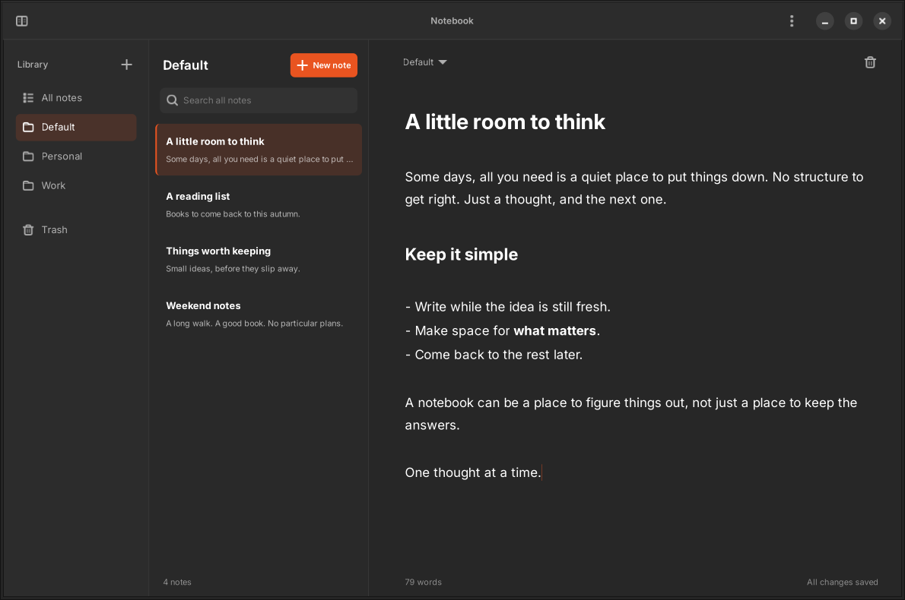

# Notebook

A native Linux note-taking app built with Rust and GTK4. Organize your notes into notebooks, write in Markdown, and keep everything on your computer. No account or internet connection required.



## Features

- **Markdown editing** with inline formatting for headings, emphasis, links, lists, task lists, quotes, and code. Markdown syntax appears in the block you're editing.
- **Notebooks and search** to organize notes and find them by word or word prefix.
- **Automatic saving** as you write, with your last note and cursor position restored when you reopen the app.
- **Focus mode** to hide navigation and give your writing more room.
- **Trash and restore** for recovering deleted notes.
- **Native appearance** that follows your GTK theme, including light and dark modes.

## Build and run

To build Notebook, you'll need Rust 1.92 or newer, a C compiler, `pkg-config`, and GTK 4.12 or newer.

On Ubuntu 24.04, install the system dependencies:

```sh
sudo apt install build-essential pkg-config libgtk-4-dev
```

With Rust installed, run these commands from the repository directory:

```sh
cargo build --release
./target/release/notebook
```

SQLite is bundled. Notebook supports Wayland and X11.

### Debian / Ubuntu package

With the build dependencies above installed, generate a release package:

```sh
cargo install cargo-deb --locked
cargo deb --locked
```

The `.deb` is written to `target/debian/` and includes a desktop application launcher. Install it with:

```sh
sudo apt install ./target/debian/notebook_0.1.0-1_amd64.deb
```

The filename depends on the package version and build architecture. Runtime dependencies are determined from the build system, so build on the oldest Debian or Ubuntu release you intend to support (with GTK 4.12 or newer).

## Using Notebook

Choose **New Note** or press **Ctrl+N** to start writing. New notes begin in **Default**. The first nonempty line becomes the note's title in the list, so there's no separate title field.

Create a notebook with the sidebar's **+** button. Use its **⋮** menu to rename or delete it. To move a note, select the notebook label above the editor. Deleting a notebook moves its notes into **Default**.

Search finds notes across all notebooks. While viewing **Trash**, search finds deleted notes instead. Restore a trashed note to edit it again.

Markdown is stored as plain text and preserved when copied. **Ctrl+click** opens web and email links. Tables, images, and HTML remain source text.

### Keyboard shortcuts

| Action | Shortcut |
| --- | --- |
| New note in Default | Ctrl+N |
| Search all notes | Ctrl+F |
| Toggle focus mode | F9 |
| Save immediately | Ctrl+S |
| Undo / redo | Ctrl+Z / Ctrl+Shift+Z |
| Trash / restore note | Ctrl+Shift+Delete |
| Return focus to editor | Escape |

## Your data

Notes are stored locally in a SQLite database at:

```text
~/.local/share/notebook/notebook.db
```

If `XDG_DATA_HOME` is set to an absolute path, the location is `$XDG_DATA_HOME/notebook/notebook.db` instead. To back up your notes, close Notebook and copy its data directory.

Notebook saves after a short pause in typing and at least every two seconds while you keep writing. If saving fails, it keeps your draft in memory and offers a retry. Undo history lasts for the current session.

This version does not include sync, import/export, attachments, or permanent deletion of trashed notes.
